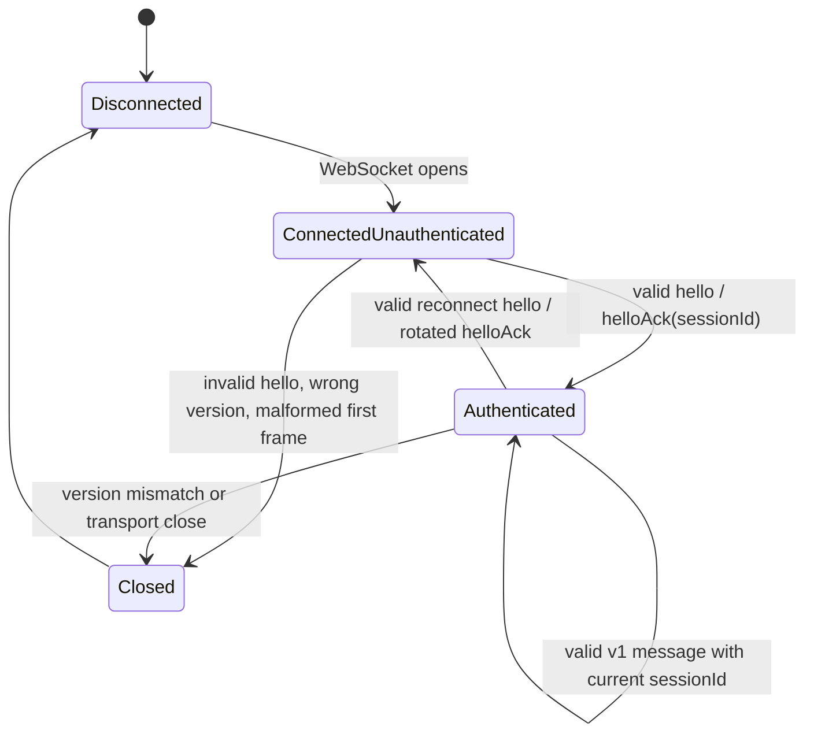
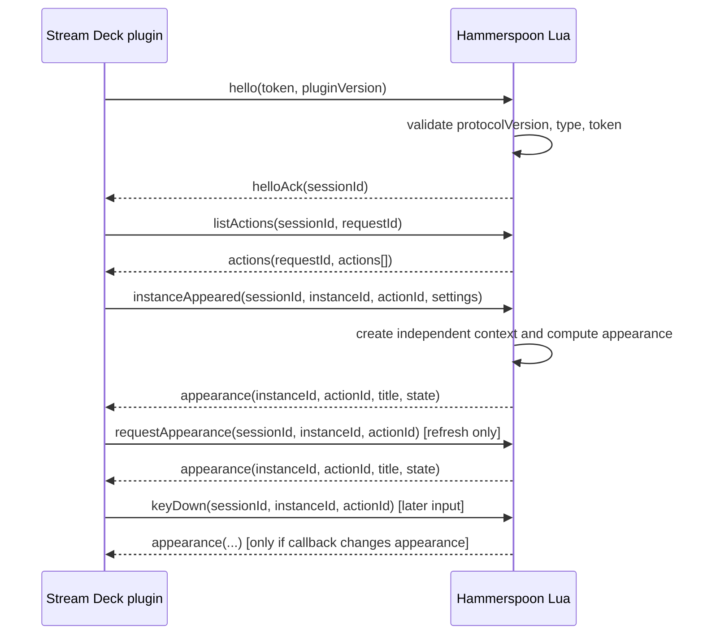

# Stream Deck–Hammerspoon protocol v1

This document is the wire contract for the first bridge slice. It describes JSON text messages carried by one authenticated WebSocket connection between the Stream Deck plugin and Hammerspoon. The protocol source of truth is the JSON Schema under `protocol/schema/`. This document explains the operational state machine and examples; it does not replace schema validation.

## Transport and framing

- The plugin is the WebSocket client. Hammerspoon is the server.
- The server binds to loopback/`localhost` only, with Bonjour disabled. The default port is `17321`.
- Each WebSocket text frame contains exactly one JSON object (one envelope). Binary frames, concatenated objects, and arrays at the frame root are malformed messages.
- WebSocket message ordering is preserved by the transport. The bridge supports one client; this is a limitation of the `hs.httpserver` WebSocket integration, not a multi-client protocol.
- Authentication is a protocol message, not an HTTP upgrade header: `hs.httpserver:websocket` exposes message callbacks but not upgrade headers or a rich connection lifecycle.
- Because `hs.httpserver` does not provide reliable close identity, Lua cannot bind authorization to a transport-close callback. The rotating `sessionId` binds every application message instead: closing/reconnecting clears contexts, and an old ID is rejected even if a stale client can still write.
- The token is read by the plugin from `~/.hammerspoon/streamdeck-token` by default and is created by Lua from two UUIDs with mode `0600`. It is an opaque shared value on the wire. It is never logged, put in Stream Deck settings, or included in an error.

The Stream Deck action UUID is the single generic UUID `com.brettinternet.hammerspoon.action`. Protocol `actionId` values identify registered Hammerspoon actions and are separate from that Stream Deck UUID.

## Envelope and common constraints

Every message is a JSON object containing these required fields:

| Field | Type and constraint |
| --- | --- |
| `protocolVersion` | JSON integer exactly `1`. |
| `type` | Non-empty JSON string; one of the v1 message types listed below. |

Message-specific required fields are listed in the message tables. Unknown fields are ignored, not rejected, and are not forwarded as settings. A required field with the wrong JSON type, a missing required field, duplicate JSON member, non-finite number, or invalid JSON makes the message malformed. Implementations must not coerce types or silently truncate values.

Unless a table says otherwise:

- `requestId`, `instanceId`, `actionId`, and `sessionId` are non-empty JSON strings. They are opaque identifiers; the sender compares them exactly, case-sensitively.
- `sessionId` is generated by Lua with `hs.host.uuid()` for each accepted `hello`. It identifies only the current authenticated WebSocket session; it is never logged or persisted.
- Every plugin → Lua message after `hello` carries the exact `sessionId` returned in that session's `helloAck`. A missing or stale value is rejected before dispatch and cannot invoke an action or mutate an instance context.
- `requestId` is unique for each outstanding request on one authenticated connection. It may be reused after its response or error has been received, but not while outstanding.
- `actionId` is a stable registered Hammerspoon action ID. The registry rejects duplicate IDs.
- `instanceId` identifies one visible Stream Deck instance. The plugin owns its value for the lifetime of that instance.
- `settings` is a JSON object. Its keys and values are application data; v1 does not interpret them.
- Text values are JSON strings. `title` is the display string and `state` is exactly integer `0` or `1`.
- The token and `pluginVersion` are non-empty JSON strings. The token is compared as an opaque value; it is never logged, and `pluginVersion` is reported for diagnostics and has no independent negotiation semantics in v1.

A valid v1 message may carry extension fields, but a v1 implementation must not depend on them. A future sender must continue to send all v1 required fields when using `protocolVersion: 1`.

## Message inventory

There are exactly ten v1 message types:

| Direction | Type | Kind | Correlation |
| --- | --- | --- | --- |
| Plugin → Lua | `hello` | authentication request | acknowledged by `helloAck` or `error` |
| Lua → Plugin | `helloAck` | authentication acknowledgement | acknowledges the connection's `hello` |
| Plugin → Lua | `listActions` | request | `requestId` echoed by `actions` or an error |
| Lua → Plugin | `actions` | response | echoes `requestId` |
| Plugin → Lua | `instanceAppeared` | lifecycle event | no acknowledgement; errors use `instanceId` |
| Plugin → Lua | `instanceDisappeared` | lifecycle event | no acknowledgement; errors use `instanceId` |
| Plugin → Lua | `keyDown` | input event | no acknowledgement; errors use `instanceId` |
| Plugin → Lua | `requestAppearance` | appearance request | no acknowledgement; errors use `instanceId` |
| Lua → Plugin | `appearance` | appearance response | identifies `instanceId`; no separate request ID |
| Lua → Plugin | `error` | asynchronous error | optional `requestId` and/or `instanceId` |

No other message type is part of v1. In particular, there is no wire-level settings-change, key-up, ping, pong, or plugin-to-Lua error message.

The state is per WebSocket connection, and the active session ID is per accepted `hello`:



1. On open, the plugin sends `hello` with the shared token as its first protocol message and sends no application message before `helloAck`.
2. Before successful authentication, Lua accepts only a valid `hello`. Any other message is rejected with `AUTH_REQUIRED`; the connection is then closed. A malformed first frame cannot authenticate and is closed after the safe error when one can be sent.
3. Lua verifies `protocolVersion`, `type`, `token`, and `pluginVersion`. A wrong token produces `AUTH_FAILED`; a non-v1 version produces `VERSION_MISMATCH`. Neither enters the authenticated state; the server closes the connection after the error.
4. Each valid `hello`, including one received while already authenticated, is accepted after token/version checks. Lua safely clears all prior instance contexts, generates a fresh non-empty opaque `sessionId` with `hs.host.uuid()`, and returns it in `helloAck.sessionId`.
5. Only after receiving that acknowledgement does the plugin send `listActions` or lifecycle/input messages. Every such message includes the exact current `sessionId`.
6. A missing `sessionId` is rejected as `INVALID_FIELD`; a stale or wrong-session value is rejected as `AUTH_REQUIRED`. Both are rejected before dispatch: no callback, appearance, context mutation, or acknowledgement is produced.
7. Authentication failure never falls back to unauthenticated mode. If the token file cannot be read, the plugin remains disconnected/offline and reports an actionable local status; it does not send an empty token or disable authentication.

`hello` and `helloAck` have no `requestId`. A reconnecting `hello` rotates the session ID, so abandoned clients holding an old ID cannot send authenticated commands. The token and every session ID are never logged.

### `hello` (plugin → Lua)

Required fields: `protocolVersion`, `type: "hello"`, `token`, `pluginVersion`. Lua validates the token and version, then sends `helloAck` or `error`.

```json
{
  "protocolVersion": 1,
  "type": "hello",
  "token": "opaque-token-value",
  "pluginVersion": "1.0.0"
}
```

### `helloAck` (Lua → plugin)

Required fields: `protocolVersion`, `type: "helloAck"`, `sessionId`. It is sent only after successful token and v1 checks. `sessionId` is a fresh non-empty opaque value generated by Lua for this accepted `hello`; it has no `requestId`.

```json
{
  "protocolVersion": 1,
  "type": "helloAck",
  "sessionId": "opaque-session-01"
}
```

## Action registry messages

### `listActions` (plugin → Lua)
Required fields: `protocolVersion`, `type: "listActions"`, `sessionId`, `requestId`. Lua requires the current session ID before evaluating the registry and responds with `actions` using the same request ID.

```json
{
  "protocolVersion": 1,
  "type": "listActions",
  "sessionId": "opaque-session-01",
  "requestId": "req-01"
}
```

### `actions` (Lua → plugin)

Required fields: `protocolVersion`, `type: "actions"`, `requestId`, `actions`. `requestId` must equal the outstanding `listActions.requestId`. `actions` is an array, including an empty array when no actions are registered. Each item requires a non-empty `actionId` and a non-empty, human-readable `name` for rendering a labeled action selector. An item may include a bounded `settingsSchema` array. Legacy arrays without `settingsSchemaVersion` remain opaque for compatibility. An explicit `settingsSchemaVersion` from 1 through 16 is accepted; only version 1 is interpreted and validated, while newer versions are preserved but not rendered.

Version 1 fields require a unique non-empty `key` (maximum 64 characters), optional non-empty `label` (maximum 128) and boolean `required`. Supported field types are `text`, `number`, `boolean`, and `select`. Text fields support integer `minLength`/`maxLength` from 0 through 4096; number fields support finite `min`/`max` within ±1e12 and positive finite `step` up to 1e12; select fields require 1–64 unique options with bounded string `value` and `label`. Defaults must match their field type and bounds, and select defaults must match an option. Field arrays and all option arrays are dense and bounded. Unknown descriptor or constraint keys, duplicate field/option values, invalid combinations, and out-of-range values are rejected as `INVALID_FIELD`; instance settings are not validated against this schema yet.

```json
{
  "protocolVersion": 1,
  "type": "actions",
  "requestId": "req-01",
  "actions": [
    { "actionId": "com.example.volumeUp", "name": "Volume Up" },
    {
      "actionId": "com.example.mute",
      "name": "Mute",
      "settingsSchemaVersion": 1,
      "settingsSchema": [
        { "type": "boolean", "key": "muted", "label": "Muted", "default": false }
      ]
    }
  ]
}
```

A response with an unknown or already-completed `requestId`, duplicate action IDs, or malformed action entries is rejected by the plugin locally and does not change its registry view. There is no plugin-to-Lua error message for a response validation failure.

## Instance lifecycle and input messages

The plugin sends these messages only after authentication and includes the current `sessionId` on every one. Lua maintains independent contexts for visible instances. `instanceAppeared` creates or refreshes the context and triggers appearance computation; `requestAppearance` is intentionally separate and is used for refresh/resynchronization. When handling a real Stream Deck event, the plugin maps initial settings from `actionInfo.payload.settings` into the wire `settings` object; it does not send the enclosing `actionInfo`.

### `instanceAppeared` (plugin → Lua)

Required fields: `protocolVersion`, `type: "instanceAppeared"`, `sessionId`, `instanceId`, `actionId`, `settings`. Lua validates the session and `actionId` before creating or refreshing the instance context and computing/sending `appearance`. A repeated appearance for the same `instanceId` and action is a settings refresh; it does not invoke `appear` again or create a second callback context.

```json
{
  "protocolVersion": 1,
  "type": "instanceAppeared",
  "sessionId": "opaque-session-01",
  "instanceId": "deck-instance-01",
  "actionId": "com.example.volumeUp",
  "settings": {
    "actionId": "com.example.volumeUp"
  }
}
```

If `actionId` is unknown, Lua sends `UNKNOWN_ACTION`, does not create a context, and does not invoke the action callback. If the same `instanceId` is already associated with a different action, Lua sends `INVALID_STATE` and leaves the existing context unchanged.

### `instanceDisappeared` (plugin → Lua)

Required fields: `protocolVersion`, `type: "instanceDisappeared"`, `sessionId`, `instanceId`, `actionId`. Lua validates the session before removing that instance context and invokes no action callback. Disappearance is idempotent for an already-removed instance; an instance/action mismatch is reported as `STALE_INSTANCE`.

```json
{
  "protocolVersion": 1,
  "type": "instanceDisappeared",
  "sessionId": "opaque-session-01",
  "instanceId": "deck-instance-01",
  "actionId": "com.example.volumeUp"
}
```

### `keyDown` (plugin → Lua)

Required fields: `protocolVersion`, `type: "keyDown"`, `sessionId`, `instanceId`, `actionId`. Lua validates the session before looking up the existing context and invoking the registered protected callback for that action, then sends any resulting appearance separately. There is no success acknowledgement. Callback failures are reported with `CALLBACK_FAILED`; the connection remains authenticated and other instances remain independent.

```json
{
  "protocolVersion": 1,
  "type": "keyDown",
  "sessionId": "opaque-session-01",
  "instanceId": "deck-instance-01",
  "actionId": "com.example.volumeUp"
}
```

An unknown action produces `UNKNOWN_ACTION`; a missing instance or action mismatch produces `STALE_INSTANCE`; neither invokes a callback.

### `requestAppearance` (plugin → Lua)

Required fields: `protocolVersion`, `type: "requestAppearance"`, `sessionId`, `instanceId`, `actionId`. Lua validates the session before looking up the context and calling the appearance/refresh path, then sends `appearance`. It does not simulate a key press and does not invoke the press callback.

```json
{
  "protocolVersion": 1,
  "type": "requestAppearance",
  "sessionId": "opaque-session-01",
  "instanceId": "deck-instance-01",
  "actionId": "com.example.volumeUp"
}
```

Unknown actions and stale instances produce the corresponding asynchronous error and no `appearance`.

## Appearance messages

### `appearance` (Lua → plugin)

Required fields: `protocolVersion`, `type: "appearance"`, `instanceId`, `actionId`, `title`, `state`. `state` must be integer `0` or `1`; `title` must be a JSON string. The optional presentation fields are enabled only by `appearanceVersion: 1`: `foregroundColor` and `backgroundColor` are six-digit `#RRGGBB` strings, `progress` is a number from `0` through `1`, and `badge` is a UTF-8 string of at most four characters (an empty badge clears it). Any presentation field without `appearanceVersion: 1` is invalid. The plugin renders the extended fields as a bounded SVG image through the SDK's `setImage`; if that capability is unavailable or fails, it deterministically retains the plain title/state rendering.

```json
{
  "protocolVersion": 1,
  "type": "appearance",
  "instanceId": "deck-instance-01",
  "actionId": "com.example.volumeUp",
  "title": "Volume +",
  "state": 0,
  "appearanceVersion": 1,
  "foregroundColor": "#FFFFFF",
  "backgroundColor": "#202020",
  "progress": 0.5,
  "badge": "½"
}
```

The plugin discards a malformed appearance, an appearance with an unknown action, or an appearance for an instance no longer visible. It does not render malformed fields or a partial invalid appearance and cannot send a plugin-to-Lua error in v1. A valid late appearance must not overwrite a different current action or instance.

## Errors

### `error` (Lua → plugin)

Errors are asynchronous and are the only negative response type. Required fields are `protocolVersion`, `type: "error"`, `code`, and `message`. `requestId` is included only when the error relates to a request that supplied one; `instanceId` is included only when an instance was identifiable. Either, both, or neither optional correlation field may be present. `message` is safe, human-readable, and must not contain the token, settings secrets, filesystem contents, stack traces, or other sensitive data.

```json
{
  "protocolVersion": 1,
  "type": "error",
  "code": "STALE_INSTANCE",
  "message": "The instance is not registered on this connection.",
  "instanceId": "deck-instance-01"
}
```

The v1 error code set is closed:

| Code | Meaning and sender behavior |
| --- | --- |
| `AUTH_REQUIRED` | Lua received a non-`hello` message before authentication, or a stale/wrong-session `sessionId`; it rejects the message before dispatch. Pre-auth rejection closes the connection; a stale-session rejection cannot invoke a callback or mutate context. |
| `AUTH_FAILED` | Lua rejected the token; it does not authenticate and closes the connection. |
| `VERSION_MISMATCH` | The peer sent a protocol version other than `1`; the message is rejected and the connection closes. |
| `MALFORMED_MESSAGE` | The JSON/envelope or required fields cannot be parsed/validated. The message is dropped; pre-auth connections close, authenticated connections remain usable when framing permits. |
| `UNKNOWN_TYPE` | The envelope has a type not defined by v1. The message is dropped; pre-auth connections close, authenticated connections remain usable. |
| `INVALID_FIELD` | A known field has an invalid value or type, including a missing required `sessionId`. The message is dropped and the connection remains authenticated. |
| `INVALID_STATE` | The message is not valid in the current protocol or instance state, such as a conflicting instance action. |
| `UNKNOWN_ACTION` | `actionId` is not in the registered Lua action registry. No action callback or appearance is produced. |
| `STALE_INSTANCE` | `instanceId` is absent from Lua's current registry, or its action does not match. No callback or appearance is produced. |
| `CALLBACK_FAILED` | A protected Lua action callback failed. Other contexts and the authenticated connection remain usable. |
| `INTERNAL` | A safe, non-specific server failure prevented handling. No implementation details are exposed. |

For a malformed frame that cannot be parsed as JSON, Lua may be unable to attach correlation fields; when it can send a valid error envelope, it uses `MALFORMED_MESSAGE` with no correlation. The plugin applies the same safe rule to malformed Lua messages locally; no undocumented error type is emitted.

## Ordering, acknowledgements, and correlation

- The plugin sends `hello` first and waits for `helloAck.sessionId`; it stores that value only in memory and injects it into every subsequent plugin → Lua application message.
- A valid `hello` on an already-authenticated connection is a reconnect/reset: Lua clears prior contexts and returns a fresh rotated `sessionId`. The prior ID is immediately invalid.
- The plugin sends `listActions` after authentication. It may have only one outstanding action-list request in the first slice; a repeated request must use a new `requestId` after completion.
- Lua processes valid application frames in received order. Lifecycle order is significant: `instanceAppeared` precedes `keyDown` or `requestAppearance` for that instance, and `instanceDisappeared` removes it for subsequent messages.
- `actions` is correlated only by exact `requestId`; response arrival order is not a substitute for correlation. An error with that `requestId` completes the request.
- Lifecycle, `keyDown`, and `requestAppearance` are events/commands with no success acknowledgement. Their failures arrive asynchronously as `error`, correlated by `instanceId`; missing/stale session errors are rejected before dispatch and have no acknowledgement.
- `instanceAppeared` causes an `appearance`; `requestAppearance` also causes an `appearance`; `keyDown` may cause an appearance after the protected callback changes state. `instanceDisappeared` causes no response.
- A transport preserves frame order, but appearance and error delivery are asynchronous relative to later event processing. The plugin applies an appearance only if its `instanceId` and `actionId` still match current visible metadata.

## Initial connection



An instance that appears while authentication or `listActions` is pending is retained by the plugin and sent only after authenticated synchronization reaches it. It is never sent before `helloAck`.

## Reconnect and synchronization

The plugin retains metadata for every visible instance in TypeScript. It stores the current `sessionId` only in memory. On WebSocket close, stop, or authentication/transport failure, it clears that ID, marks instances `Hammerspoon Offline`, and does not invoke callbacks locally. It retries with bounded exponential backoff: 250 ms, doubling up to 10 seconds, with jitter. The backoff resets only after a successful authenticated `helloAck`.

Lua reload drops the action registry's live instance contexts and starts a new server. Therefore the plugin cannot assume that a reconnecting server remembers actions or instances. Every accepted reconnect `hello` rotates the Lua session ID; after each new `helloAck(sessionId)`, the plugin:

1. sends `listActions` with a fresh `requestId`;
2. receives `actions` (or handles its correlated error);
3. replays each currently visible instance as `instanceAppeared` in deterministic retained-instance order;
4. sends `requestAppearance` for each replayed instance, after its `instanceAppeared` frame;
5. clears the offline title only when synchronization has been accepted for that instance; unknown action IDs remain visibly unavailable and receive no appearance.

A reconnect does not synthesize `keyDown`, `instanceDisappeared`, or an acknowledgement for the old connection. Lua rejects any old or missing session ID before dispatch, so an abandoned client cannot invoke callbacks or mutate contexts. A stale response from an old transport cannot update the new connection. If a visible instance disappears while synchronization is queued, the plugin removes it from the replay set and does not send it.

```mermaid
sequenceDiagram
    participant P as Stream Deck plugin
    participant L as New Hammerspoon Lua server
    Note over P: Existing visible metadata retained; title = Hammerspoon Offline
    P->>L: hello(token, pluginVersion)
    L->>L: new connection; clear prior contexts and rotate sessionId
    L-->>P: helloAck(new sessionId)
    P->>L: listActions(new sessionId, new requestId)
    L-->>P: actions(new requestId, actions[])
    loop each currently visible instance
        P->>L: instanceAppeared(new sessionId, instanceId, actionId, settings)
        L-->>P: appearance(instanceId, actionId, title, state)
        P->>L: requestAppearance(new sessionId, instanceId, actionId)
        L-->>P: appearance(instanceId, actionId, title, state)
    end
    Note over P: Offline title cleared only for synchronized valid instances
```

## Versioning and compatibility

v1 has no capability negotiation and no downgrade path. Both directions require `protocolVersion: 1`. A peer that receives another version sends `VERSION_MISMATCH` when it can form a safe error and closes; the other peer remains offline/retries rather than guessing a schema.

Within version 1, compatibility is additive:

- Unknown envelope and payload fields are ignored.
- Existing required fields, field types, message meanings, error codes, and `state` values cannot be changed under version 1.
- A new message type, a new required field, a changed field type, or a new interpretation of an existing field requires a new protocol version (and corresponding schema).
- Receivers must not forward unknown fields into Lua settings or use them to alter callback semantics.
- Unknown action IDs and stale instance IDs are normal synchronization failures, not version negotiation; they produce the safe errors above and never trigger a guessed fallback action.

## Schema ownership and validation

`protocol/schema/` owns the canonical JSON Schema for v1. TypeScript validates incoming and outgoing protocol objects with Ajv against that schema. Lua cannot directly execute JSON Schema, so its implementation mirrors the schema's strict required-field and type checks, version/type dispatch, enum checks, and correlation checks. The Lua mirror ignores unknown fields in the same way as the canonical v1 contract. Conformance examples and tests must exercise both validators to prevent drift; a documentation example is not permission to add a message or field absent from the canonical schema.
